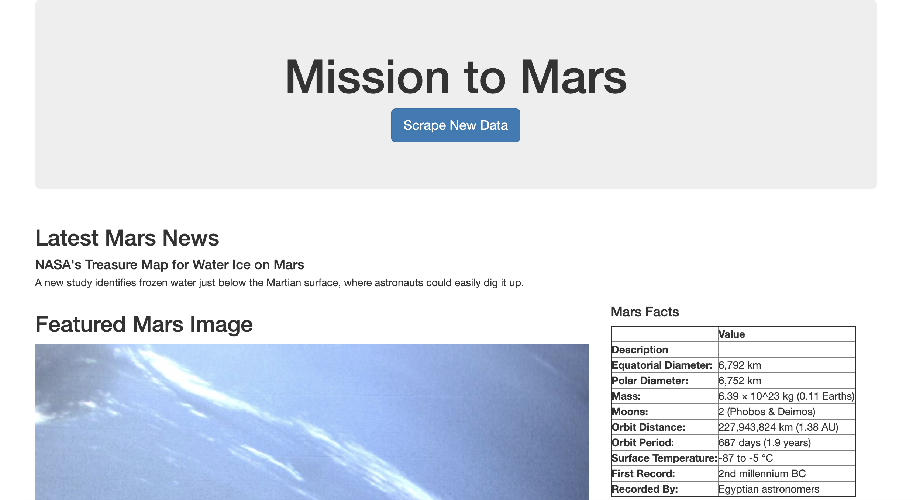
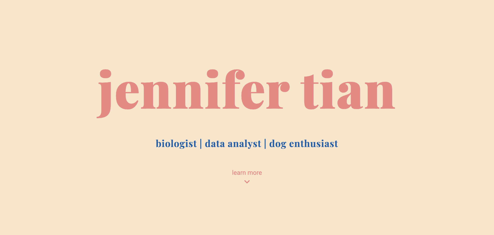
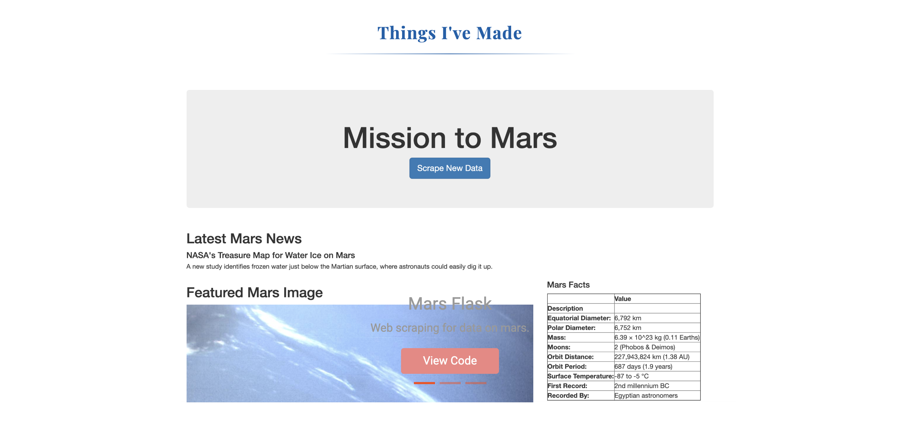

# Mission to Mars
module 10 challenge

## Goals
To create a flask page that presents data colelcted from various webpages using automated web scraping services such as BeautifulSoup and splinter.

## Flask Page
To accomplish this task I've created a flask app that continually updates with the latest news on the subject, images, mars facts, and hemisphere images.

### Portfolio
This page can also be viewed on my portfolio, see below.

